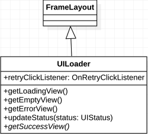
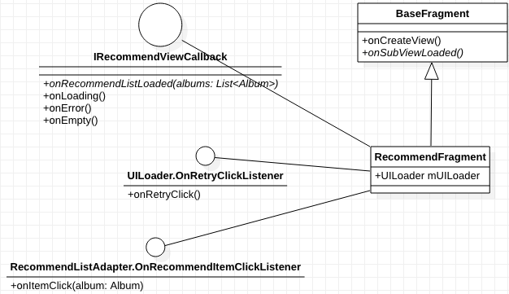
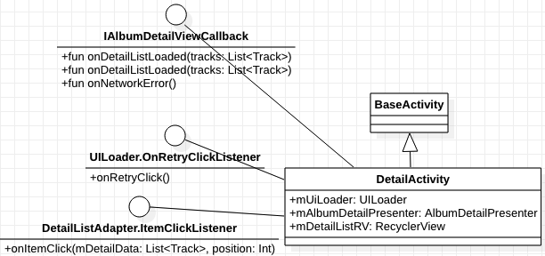
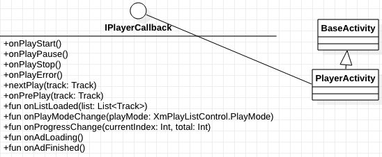
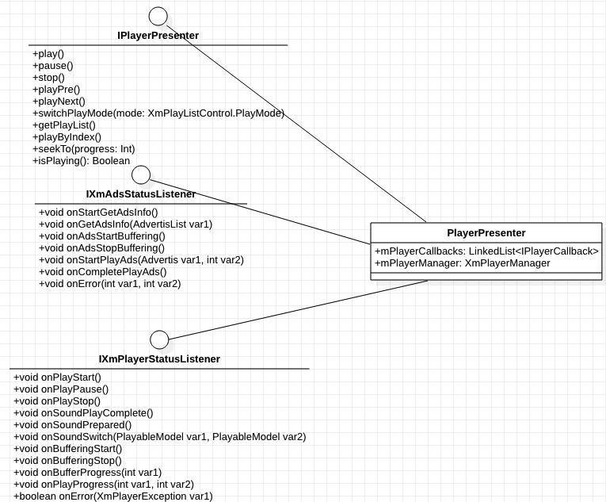

# 一.架构

喜马拉雅项目采用的是MVP架构。

Activity和Fragment承担View职责，负责UI界面的初始化，布局的加载。

Presenter类负责与用户的复杂逻辑处理，本应由Model层通过本地持久化存储或者网络来获取数据，但鉴于项目已经导入喜马拉雅官方SDK，获取数据的代码寥寥数行，
就不再新建Model类来负责数据获取，故Presenter也承担起获取数据的责任。

# 二.常用控件及其应用的设计模式

### UILoader

\
\
UILoader类图如上所示。
由于除了成功的UI界面，加载UI界面，错误UI界面，空白UI界面是固定不变的，所以UILoader使用了模版方法设计模式，
实现了getLoadingView(),getErrorView(),getEmptyView()三个方法，
预留了getSuccessView()方法给实例化UILoader的类去实现，复用了UI界面。
\
\
首先Presenter(不局限于特定的Presenter)将获取数据的状态返回给View层，持有UILoader实例的View层就会调用其updateStatus()更新UILoader的UI,
UIStatus是一个定义在UILoader的枚举类，总共有LOADING,SUCCESS,NETWORK_ERROR,EMPTY,NONE五个状态。
\
\
这里需要注意的是，OnRetryClickListener是定义在UILoader内部的接口，只有onRetryClick()一个抽象方法，由持有UILoader实例的View层去负责实现这个接口，
当用户点击空页面，错误页面时，会调用onRetryClick()让View层执行
获取重新获取操作。
\
\
这里使用到的设计模式是观察者模式，该模式在本项目有着较多的应用，后面遇到该模式则不会再赘述。

### Presenter
前文提到过本项目采用的是MVP架构，所以该项目有较多的Presenter类，根据MVP架构规范，Presenter类应是全局只有一个实例，该项目严格遵守了此条准则，每个Presenter类都只有一个实例，
至于是如何实现单例的，就不再赘述。

### Fragment实例化方式

该项目总共有三个Fragment，HistoryFragment，RecommendFragment,SubsriptionFragment，该项目没有直接实例化的方式，而是使用了简单工厂设计模式，
统一由FragmentCreator进行实例化，由客户MainContentAdapter(继承于FragmentPagerAdapter)传入index参数(每个Fragment都对应一个特定的index )来生成指定的Fragment。

# 三.流程

## 推荐页面流程

  

如上图所示，当用户选择并点击推荐页面RecommendFragment中的某个专辑时，就会进入相对应专辑的详情界面，也就是DetailActivty，当用户选择并点击详情页面的某一集时，则会进入对应集数的播放界面，也就是PlayerActivity。

需要注意的是，RecommendFragment和DetailActivty都使用了RecyclerView，所以部分事件和UI绘制都在相应的Adapter中。(RecommendFragment对应RecommendListAdapter，DetailActivty对应DetailListAdapter)

### RecommendFragment

上图所示即为RecommendFragment的uml图。
\
\
RecommendFragment继承于BaseFragment，复写父类预留的onSubViewLoaded()方法，将mUILoader作为返回值。
\
\
RecommendFragment实现了IRecommendViewCallback接口，RecommendPresenter负责获取推荐专辑数据，
获取状态会通过IRecommendViewCallback通知RecommendFragment，
RecommendFragment根据状态去更新UI，获取状态或为成功/错误/空/加载中，详情可见UILoader。
\
\
当用户点击了RecommendListAdapter列表中的某个专辑时，RecommendListAdapter就会调用onItemClick(album: Album)通知RecommendFragment用户点击了哪个专辑。

### DetailActivity

\
\
上图所示即为DetailActivity的UML图。
\
\
DetailActivity的UML图与RecommendFragment的类似，依赖一个Presenter，UILoader和RecyclerView。
\
\
当Presenter会将获取数据的状态通过IAlbumDetailViewCallback通知DetailActivity。
\
\
当用户点击某一集数时，IAlbumDetailViewCallback会通知DetailActivity用户点击了哪集，DetailActivity将该数据转交给PlayerPresenter，后跳转至PlayerActivity。

### PlayerActivity 

从PlayerActivity的UML可以看出，该Activity实现不复杂，这是因为主要的复杂逻辑都在Presenter上，所以这里就不再对PlayerActivity进行赘述，我更多想针对PlayerPresenter做一个详细的文档说明。

可以看到PlayerPresenter总共实现了三个接口，一个自定义接口IPlayerPresenter(Kotlin语言实现)，两个喜马拉雅官方接口(Java语言实现)。

该PlayerPresenter的播放逻辑如上图所示，当PlayerActivity调用PlayerPresenter去播放时，PlayerPresenter会去调用PlayerManger去播放，而PlayerManger首先会播放广告，通过IXmAdsStatusListener接口通知
PlayerPresenter广告的播放进度，PlayerManger播放完广告后，才会播放用户所选中的集，并通过IXmPlayerStatusListener通知PlayerPresenter当前集的播放状态，
PlayerPresenter再通过IPlayerCallback通知PlayerActivity当前集的播放状态。
\
\
其他操作逻辑亦是如此，不管是播放上一集，播放下一集，暂停，开始等操作，都是由PlayerActivity调用PlayerPresenter，PlayerPresenter调用PlayerManger，PlayerManger回调PlayerPresenter，PlayerPresenter回调PlayerActivity。